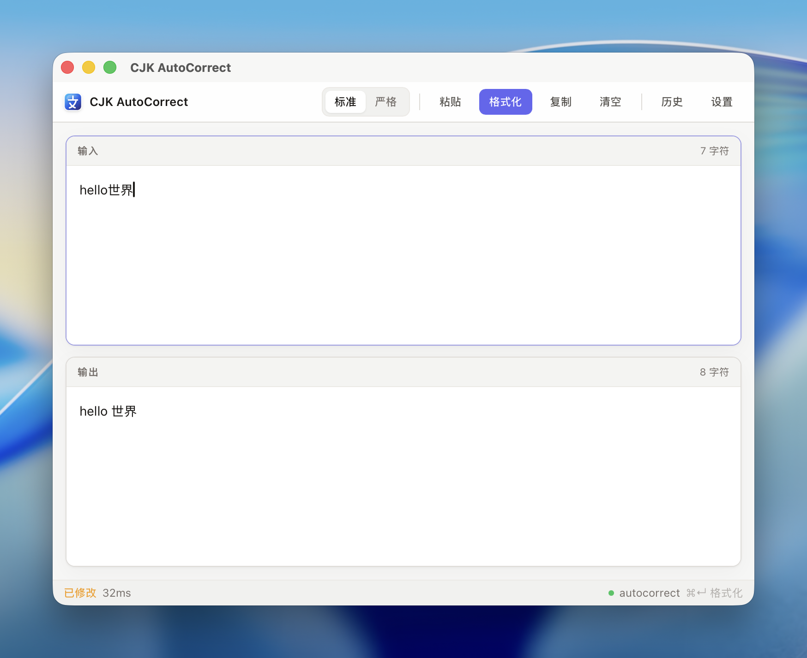

<div align="center">

# CJK AutoCorrect Desktop

**中日韩文本自动格式化桌面工具**

[简体中文](./README.md) | [English](./README.en.md)

[](https://v2.tauri.app/)
[](https://react.dev/)
[](https://www.rust-lang.org/)
[](./LICENSE)

</div>

---

基于 [autocorrect](https://github.com/huacnlee/autocorrect) 引擎的桌面客户端，为中日韩（CJK）文本提供本地即时排版格式化。它可以自动在中文与英文/数字之间添加空格、修正全半角标点，并通过标准模式或严格模式适配不同的格式化强度。

## ✨ 功能特性

- **本地即时格式化** — 粘贴或输入文本后，一键生成格式化结果，支持复制、清空和 `Cmd/Ctrl + Enter` 快捷格式化
- **标准 / 严格模式** — 标准模式处理常见 CJK 排版；严格模式会调用 `autocorrect --strict` 使用更严格的规则
- **默认模式同步** — 可在设置中选择默认格式化模式，主界面会自动读取并同步当前配置
- **剪贴板工作流** — 支持从剪贴板读取文本，并将格式化结果写回剪贴板
- **全局快捷键** — 默认 `Cmd/Ctrl + Shift + F`，支持在设置页录制自定义组合键
- **历史记录增强** — 仅保存实际发生修改的记录，支持搜索、按模式筛选、复制结果、恢复到主界面和清空历史
- **引擎检测与路径配置** — 自动检测本机 `autocorrect` CLI，也可以手动指定二进制路径
- **系统集成** — 支持系统托盘、关闭窗口时最小化到托盘、开机自启动
- **外观设置** — 支持浅色、深色和跟随系统主题

## 📸 截图



## 🚀 安装与使用

CJK AutoCorrect Desktop 依赖本机 `autocorrect` CLI 作为格式化引擎。

1. 从 [Releases](../../releases) 下载适合你系统的安装包。
2. 安装本机 `autocorrect` CLI。
3. 打开应用，确认底部状态栏显示 `autocorrect` 已可用，即可开始格式化。

未安装 `autocorrect` 时可以打开应用和设置，但无法执行格式化；安装后重启应用，或在设置中手动指定 `autocorrect` 路径。

### 安装 autocorrect

```bash
# macOS
brew install huacnlee/tap/autocorrect

# Windows
scoop install autocorrect

# 或通过 Cargo
cargo install autocorrect
```

## 🧑‍💻 开发

### 开发环境

- [Node.js](https://nodejs.org/) ≥ 18
- [pnpm](https://pnpm.io/) ≥ 8
- [Rust](https://www.rust-lang.org/tools/install) ≥ 1.77
- [autocorrect](https://github.com/huacnlee/autocorrect) ≥ 2.0，用于本地格式化测试

### 启动开发模式

```bash
# 克隆仓库
git clone https://github.com/cuitz/cjk-autocorrect-desktop.git
cd cjk-autocorrect-desktop

# 安装前端依赖
pnpm install

# 启动开发模式
pnpm tauri dev
```

### 本地构建

```bash
pnpm tauri build
```

构建产物位于 `src-tauri/target/release/bundle/`。

## 🏗️ 技术架构

```
┌─────────────────────────────────────────────┐
│                 Frontend                     │
│   React 19 · TypeScript · Tailwind CSS 4    │
│              Zustand · Vite 7                │
├─────────────────────────────────────────────┤
│               Tauri v2 Bridge               │
├─────────────────────────────────────────────┤
│                 Backend                      │
│          Rust · FormatterEngine              │
│        autocorrect CLI (stdin pipe)          │
└─────────────────────────────────────────────┘
```

| 层级 | 技术 | 说明 |
|------|------|------|
| 前端 | React 19 + TypeScript | 组件化 UI，Zustand 状态管理 |
| 样式 | Tailwind CSS 4 | CSS 变量驱动的 Stone/Indigo 设计令牌 |
| 桥接 | Tauri v2 Commands | 类型安全的前后端通信 |
| 后端 | Rust | 格式化引擎、配置管理、历史存储 |
| 引擎 | autocorrect CLI | 通过 `--stdin` 管道调用外部二进制 |

### 项目结构

```
src/                          # 前端源码
├── components/
│   ├── FormatPage.tsx        # 格式化主界面（输入/输出分栏）
│   ├── HistoryPage.tsx       # 历史记录
│   └── SettingsPage.tsx      # 设置页面
├── lib/commands.ts           # Tauri invoke 封装与类型定义
└── stores/                   # Zustand 状态管理
    ├── config.ts
    ├── engine.ts
    ├── format.ts
    └── history.ts

src-tauri/src/                # 后端源码
├── commands/                 # Tauri Command 层
│   ├── app_config.rs         # 配置加载/保存
│   ├── clipboard.rs          # 剪贴板读写
│   ├── engine_cmd.rs         # 引擎状态检测
│   ├── format_cmd.rs         # 格式化文本
│   └── history_cmd.rs        # 历史记录查询/清空
├── config/app_config.rs      # AppConfig 结构与持久化
├── engine/
│   ├── types.rs              # FormatMode, FormatterEngine trait
│   └── autocorrect_cli.rs    # autocorrect CLI 引擎实现
├── services/formatter.rs     # 格式化服务
├── history_store/store.rs    # JSONL 文件历史存储
├── dto.rs                    # 前后端数据传输对象
├── errors.rs                 # 统一错误类型
└── lib.rs                    # 应用入口（托盘、快捷键、自启动）
```

## ⌨️ 格式化模式

| 模式 | 说明 |
|------|------|
| **标准模式** | 自动在中文与英文/数字之间添加空格，修正全半角标点 |
| **严格模式** | 调用 `autocorrect --strict`，在标准格式化基础上使用更严格的规则 |

## ⚙️ 配置

应用配置文件位置：

- **macOS**: `~/Library/Application Support/cjk-autocorrect-desktop/config.json`
- **Windows**: `%APPDATA%/cjk-autocorrect-desktop/config.json`
- **Linux**: `~/.local/share/cjk-autocorrect-desktop/config.json`

历史记录存储为同目录下的 `history.jsonl`。

## 🔒 隐私说明

CJK AutoCorrect Desktop 是本地优先的桌面工具，不会上传你的文本内容。

- 格式化在本机完成，应用通过本地 `autocorrect` CLI 处理输入文本
- 剪贴板读取和写入只在你主动使用相关操作或快捷键时触发
- 历史记录只保存到本机的 `history.jsonl` 文件中，未修改的文本不会写入历史
- 你可以在应用内清空历史记录，也可以删除应用配置目录中的历史文件
- 项目本身不包含遥测、账号系统或远程同步逻辑

更多细节见 [PRIVACY.md](./PRIVACY.md)。

## 🛠️ 开发工具

推荐 IDE 配置：

- [VS Code](https://code.visualstudio.com/)
- [Tauri](https://marketplace.visualstudio.com/items?itemName=tauri-apps.tauri-vscode) 扩展
- [rust-analyzer](https://marketplace.visualstudio.com/items?itemName=rust-lang.rust-analyzer) 扩展
- [Tailwind CSS IntelliSense](https://marketplace.visualstudio.com/items?itemName=bradlc.vscode-tailwindcss) 扩展

## 📄 License

[MIT](./LICENSE)
